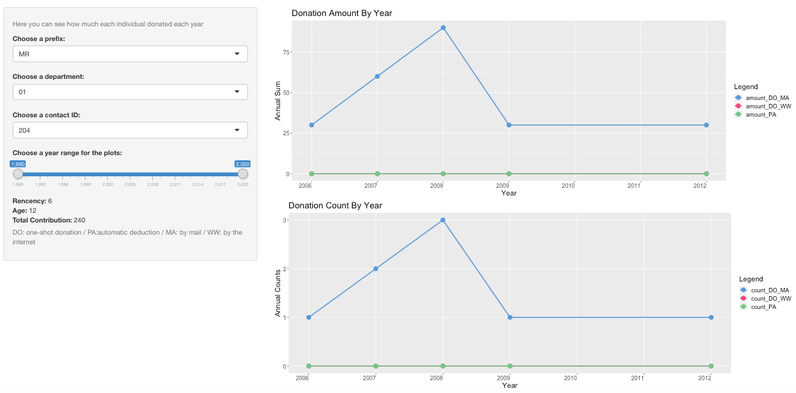
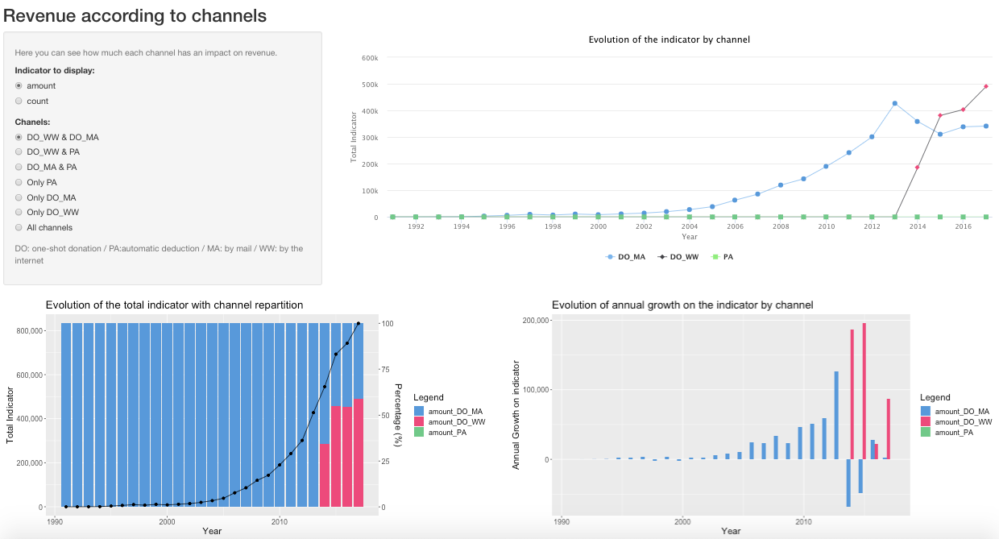
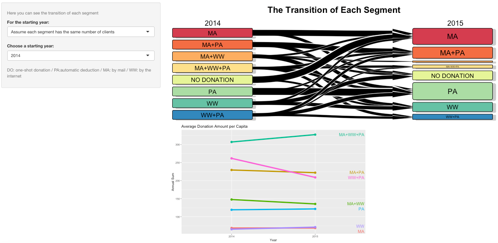

# Marketing Analytics Channel Management Booster
_This work is related to __in-class project in Marketing Analytics class__ and was done by A-C. Bourland, R. Chen, I. Zizi and A. Ohleyer._  
__Due to confidential reasons, the data is not included in the repository__ 
__The description of each tabs of the Dashboard is inside the [Presentation](Presentation.pdf) of our work__

## CONTEXT
The goal of this project was to analyse data from a charity association that want to improve their marketing targeting through their different channels. We decided to answer this channel and to help the manager with a dashboard.

## DATA
Data were drawn from a SQL database structured in 3 parts:

### Contacts
The contacts table contains the list of individuals who have made a donation to the charity in the past, although some of these individuals may have no corresponding donations in the database.
Fields are: contact information, if s/he's active or not

### Actions
The charity will send solicitations to its donors to generate further donations. Every time a donor is solicited, it triggers an entry in the “actions” table.
Fields are: the campaign id, the message id

### Acts
The table “acts” corresponds to donations. 
Fields are: the act type, the payment method, the channel id

## DASHBOARD
The goal of this project was to analyse data from a charity association that want to improve their marketing targeting through their different channels.

### TAB 1

### TAB 2

### TAB 3

